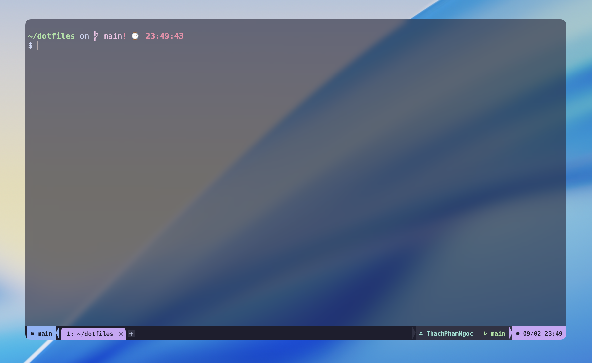
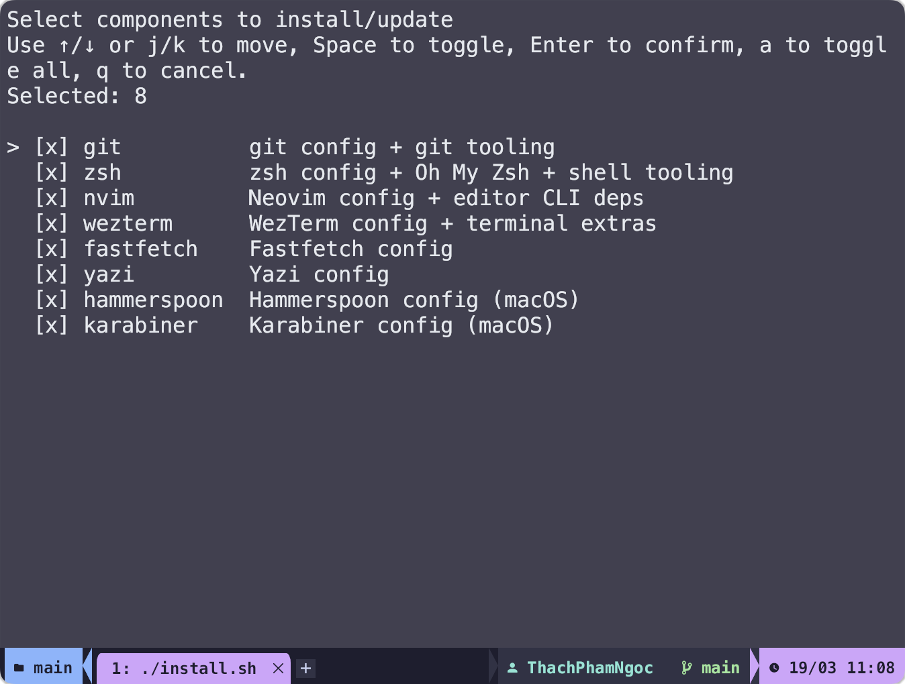
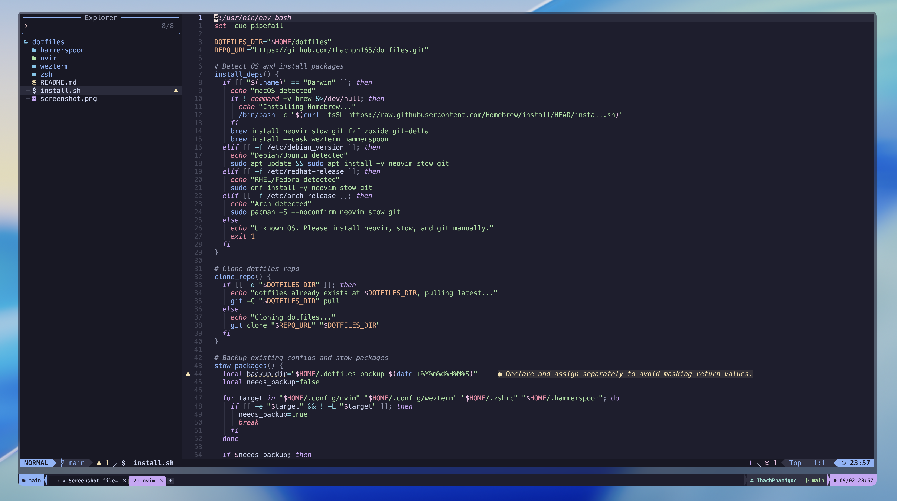

# Dotfiles

Dotfiles cá nhân, quản lý bằng [GNU Stow](https://www.gnu.org/software/stow/), gom các cấu hình mình dùng hằng ngày cho terminal, editor, shell, window management và key remap trên macOS.

Repo này không chỉ có `nvim` và `wezterm`, mà là một bộ workflow tương đối đầy đủ:

- `WezTerm`: giao diện Catppuccin Mocha, nền transparent, tab/status bar đặt lại, hotkey toggle nhanh kiểu dropdown terminal, và trợ lý AI đơn giản qua OpenAI API.
- `Neovim`: LazyVim + các plugin phục vụ code, note, và xử lý IME để gõ tiếng Việt không phá `Normal Mode`.
- `Hammerspoon`: hotkey toàn hệ thống để bật/tắt WezTerm và quản lý cửa sổ nhanh.
- `Karabiner`: remap `Caps Lock` thành `Hyper` và thêm bộ điều hướng/phím chọn kiểu Vim cho toàn hệ thống.
- `Zsh`, `Yazi`, `Git`, `fastfetch`: tối ưu shell workflow, di chuyển thư mục nhanh, file manager trong terminal, và trải nghiệm CLI hằng ngày.



## <a id="muc-luc"></a>Mục lục

- [Dotfiles](#dotfiles)
  - [Mục lục](#mục-lục)
  - [Cài nhanh](#cài-nhanh)
  - [Script cài nhanh sẽ tự làm gì?](#script-cài-nhanh-sẽ-tự-làm-gì)
  - [Gồm những gì?](#gồm-những-gì)
  - [Cài thủ công](#cài-thủ-công)
  - [Yêu cầu](#yêu-cầu)
  - [Hammerspoon](#hammerspoon)
  - [Karabiner](#karabiner)
  - [Zsh](#zsh)
    - [Plugins](#plugins)
    - [Tools](#tools)
    - [SSH (tích hợp WezTerm)](#ssh-tích-hợp-wezterm)
  - [Cần cấu hình các alias cho Host trước tại `~/.ssh/config`.](#cần-cấu-hình-các-alias-cho-host-trước-tại-sshconfig)
  - [Yazi](#yazi)
    - [Shortcut chính](#shortcut-chính)
  - [Neovim](#neovim)
    - [Gõ tiếng Việt mà không phá Normal/Visual mode](#gõ-tiếng-việt-mà-không-phá-normalvisual-mode)
    - [Obsidian (ghi chú)](#obsidian-ghi-chú)
    - [Gợi ý học Vim](#gợi-ý-học-vim)
  - [Git](#git)
    - [Delta](#delta)
  - [WezTerm](#wezterm)
    - [Giao diện](#giao-diện)
    - [Phím tắt](#phím-tắt)
      - [Pane](#pane)
      - [Tab](#tab)
      - [Workspace và Session](#workspace-và-session)
      - [Khac](#khac)
    - [Quản lý session](#quản-lý-session)
    - [Trợ lý AI](#trợ-lý-ai)
      - [Cài đặt](#cài-đặt)
      - [Sử dụng](#sử-dụng)
    - [Cấu trúc config](#cấu-trúc-config)

## <a id="cai-nhanh"></a>Cài nhanh



```bash
bash <(curl -fsSL https://raw.githubusercontent.com/thachpn165/dotfiles/main/install.sh)
```

README này hiện tập trung cho `macOS`.

Script sẽ mở menu chọn component ngay trong terminal: dùng `Space` để bật/tắt, `↑/↓` hoặc `j/k` để di chuyển, rồi `Enter` để xác nhận. Nếu đã từng chạy trước đó, selection cũ sẽ được tick sẵn.

Ví dụ chạy non-interactive:

```bash
bash <(curl -fsSL https://raw.githubusercontent.com/thachpn165/dotfiles/main/install.sh) -- --only zsh,nvim,wezterm
bash <(curl -fsSL https://raw.githubusercontent.com/thachpn165/dotfiles/main/install.sh) -- --skip karabiner,hammerspoon
```

## <a id="script-cai-nhanh-se-tu-lam-gi"></a>Script cài nhanh sẽ tự làm gì?

Nếu máy chưa có, `install.sh` sẽ tự xử lý các phần sau cho những component bạn chọn:

- Cài [Homebrew](https://brew.sh/).
- Cài `git` và `stow` trước, rồi cài thêm dependency đúng theo component được chọn.
- Nếu chọn `zsh`, script sẽ cài [Oh My Zsh](https://ohmyz.sh/) nhưng giữ nguyên `~/.zshrc` để dùng file được stow từ repo này.
- Nếu chọn `wezterm` trên macOS, script sẽ cài thêm `pngpaste`, [WezTerm](https://wezterm.org/) và [`im-select`](https://github.com/daipeihust/im-select).
- Nếu chọn `hammerspoon` hoặc `karabiner` trên macOS, script sẽ cài app tương ứng qua Homebrew Cask.
- Clone repo vào `~/dotfiles` nếu chưa có; nếu đã có thì `git pull`.
- Tự init/update git submodules.
- Backup config cũ sang thư mục dạng `~/.dotfiles-backup-YYYYMMDDHHMMSS/` trước khi stow nếu phát hiện file/folder thật đang tồn tại.
- Dùng `stow --restow` cho đúng component được chọn, nên có thể chạy lại để update mà không phải relink toàn bộ.
- Ghi nhớ selection gần nhất để lần rerun sau có thể dùng lại ngay.

Script **không** tự làm các phần sau, bạn vẫn cần cấu hình tay nếu muốn dùng đầy đủ:

- `OPENAI_API_KEY` cho WezTerm AI assistant.
- `~/.ssh/config` và alias host nếu muốn dùng SSH picker / phân biệt `prod` / `staging`.
- Quyền **Accessibility** cho Hammerspoon trên macOS.
- Quyền **Input Monitoring** và **Accessibility** cho Karabiner-Elements trên macOS.
- `OBSIDIAN_VAULT` nếu vault của bạn không nằm ở path mặc định.

## <a id="gom-nhung-gi"></a>Gồm những gì?

| Package | Target | Cách hoạt động |
|---|---|---|
| `nvim` | `~/.config/nvim/` | stow (symlink) |
| `wezterm` | `~/.config/wezterm/` | stow (symlink) |
| `zsh` | `~/.zshrc`, `~/.oh-my-zsh/custom/` | stow (symlink) |
| `hammerspoon` | `~/.hammerspoon/` | stow (symlink) |
| `git` | `~/.gitconfig` | stow (symlink) |
| `fastfetch` | `~/.config/fastfetch/` | stow (symlink) |
| `yazi` | `~/.config/yazi/` | stow (symlink) |
| `karabiner` | `~/.config/karabiner/` | stow (symlink) |

## <a id="cai-thu-cong"></a>Cài thủ công

Cài các dependency ở mục [Yêu cầu](#yêu-cầu) trước, rồi chạy:

```bash
git clone https://github.com/thachpn165/dotfiles.git ~/dotfiles
cd ~/dotfiles
git submodule update --init --recursive
stow --restow nvim
stow --restow wezterm
stow --restow zsh
stow --restow hammerspoon
stow --restow git
stow --restow fastfetch
stow --restow yazi
stow --restow karabiner
```

## <a id="yeu-cau"></a>Yêu cầu

Để chạy script cài nhanh, bạn chỉ cần:

- `bash`
- `curl`
- Kết nối Internet
- Hệ điều hành `macOS`

Nếu bạn không dùng `install.sh` mà muốn cài thủ công, các dependency chính của repo này là:

- [Neovim](https://neovim.io/) (LazyVim)
- [WezTerm](https://wezterm.org/)
- [Oh My Zsh](https://ohmyz.sh/) (theme: amuse)
- [GNU Stow](https://www.gnu.org/software/stow/)
- Git
- [delta](https://github.com/dandavison/delta) (diff đẹp và dễ đọc)
- [Hammerspoon](https://www.hammerspoon.org/) (hotkey toàn hệ thống + tiling)
- [Karabiner-Elements](https://karabiner-elements.pqrs.org/) (remap phím toàn hệ thống trên macOS)
- [eza](https://github.com/eza-community/eza) (thay thế `ls`, có tree/icons, xem git status)
- [bat](https://github.com/sharkdp/bat) (thay thế `cat`, preview đẹp; tích hợp preview cho `Ctrl+T` trong fzf)
- [fastfetch](https://github.com/fastfetch-cli/fastfetch) (welcome screen khi mở terminal session mới)
- [fzf](https://github.com/junegunn/fzf) (fuzzy finder)
- [zoxide](https://github.com/ajeetdsouza/zoxide) (smart cd)
- [yazi](https://github.com/sxyazi/yazi) (terminal file manager cho workflow ops)
- [ripgrep](https://github.com/BurntSushi/ripgrep) (Telescope live grep)
- [jq](https://jqlang.org/) (WezTerm AI assistant build/parse JSON)
- [glow](https://github.com/charmbracelet/glow) (markdown preview trong Neovim)
- [im-select](https://github.com/daipeihust/im-select) (macOS IME switching cho Neovim/VSCodeVim)
- macOS (tuỳ chọn): `pngpaste` (Obsidian paste image)

---

## <a id="hammerspoon"></a>Hammerspoon

Mục tiêu: thay thế app như Rectangle bằng 1 file `init.lua` nhỏ gọn, sử dụng phím tắt nhanh.

| Phím | Tác vụ |
|---|---|
| `Cmd+J` | Toggle WezTerm (an/hien/launch trên màn hình đang focus) |
| `Ctrl+Alt+Left` | Snap left half |
| `Ctrl+Alt+Right` | Snap right half |
| `Ctrl+Alt+Up` | Snap top half |
| `Ctrl+Alt+Down` | Snap bottom half |
| `Ctrl+Alt+F` | Maximize |
| `Ctrl+Alt+C` | Center (70%) |

Ghi chú:

- Lần đầu mở cần cấp quyền **Accessibility**: System Settings -> Privacy & Security -> Accessibility.
- Config tự reload khi save.

---

## <a id="karabiner"></a>Karabiner

Repo này track file `karabiner/.config/karabiner/karabiner.json` và stow vào `~/.config/karabiner/karabiner.json`.

### Cài Karabiner-Elements và EventViewer

Trên macOS, script `install.sh` sẽ tự cài `karabiner-elements`.

Nếu cài tay bằng Homebrew:

```bash
brew install --cask karabiner-elements
```

`Karabiner-EventViewer` đi kèm chung với `Karabiner-Elements`, nên không cần cài thêm cask riêng. Sau khi cài xong có thể mở từ Spotlight hoặc:

```bash
open -a Karabiner-Elements
open -a Karabiner-EventViewer
```

Lần đầu mở, macOS sẽ yêu cầu cấp quyền `Input Monitoring` và `Accessibility` cho Karabiner.

Nếu dùng bàn phím rời, vào `Karabiner-Elements` -> `Devices`, chọn đúng keyboard đang dùng và bật `Modify events`. Nếu không bật mục này thì remap có thể không ăn trên bàn phím ngoài dù app vẫn đang chạy.

### Cài config từ repo này

Nếu đã clone repo và dùng `stow`, chỉ cần:

```bash
stow karabiner
```

Sau đó mở `Karabiner-Elements` để app reload config, hoặc thoát/mở lại app nếu chưa nhận file mới.

### Keymap hiện tại

- `simple_modifications` đang hoán đổi 2 phím vật lý: `Caps Lock -> Left Control` và `Left Control -> Caps Lock`.
- Vì có bước hoán đổi này, phím `Left Control` vật lý mới là phím kích hoạt `Hyper` (`Cmd+Ctrl+Option+Shift`) trong các `complex_modifications`.
- Phím `Caps Lock` vật lý hiện hoạt động như `Left Control`.
- Hiểu theo cách bấm thực tế:
  - Bấm phím `Left Control` vật lý sẽ được Karabiner nhìn như `caps_lock`.
  - Từ đó rule `caps_lock -> Hyper` mới được kích hoạt.
  - Bấm phím `Caps Lock` vật lý thì hệ thống nhận như `Left Control` bình thường.
- Ví dụ:
  - `Left Control + h` vật lý sẽ thành `Hyper + h`, sau đó map ra `Left Arrow`.
  - `Left Control + j/k/l` vật lý sẽ lần lượt thành `Down/Up/Right Arrow`.
  - `Caps Lock` vật lý không phải là phím `Hyper` trong cấu hình hiện tại.
- `Hyper + h/j/k/l` thành mũi tên trái/xuống/lên/phải.
- `Hyper + u/d` thành `Page Up` / `Page Down`.
- `Hyper + a/e` thành `Home` / `End`.
- `Hyper + w/b` chọn theo từ sang phải / trái.
- `Hyper + Space` clear vùng chọn bằng cách di chuyển sang phải một ký tự.

---

## <a id="zsh"></a>Zsh

Một số plugin ZSH hữu ích mình sử dụng mỗi ngày.

- Gợi ý lệnh từ history (`zsh-autosuggestions`)
- Highlight lệnh để giảm sai (`fast-syntax-highlighting`)
- Tìm kiếm file/command nhanh (`fzf`)
- Nhớ đường dẫn thông minh (`zoxide`), chỉ cần gõ `z <tên-folder>` không cần gõ full path.
- SSH vào prod/staging là biết ngay mình đang ở đâu (màu tab/status trong WezTerm)

### Plugins

- `zsh-autosuggestions`: gõ 1 lần, nhớ cả đời
- `fast-syntax-highlighting`: highlight lệnh bash nhanh gọn nhẹ

### Tools

| Tool | Làm gì | Dùng khi nào |
|---|---|---|
| `eza` | thay `ls` (icons/tree/git) | `ls`, `ll`, `lt`, `lg` |
| `bat` | thay `cat` (highlight + line numbers) | preview trong `fzf` (`Ctrl+T`) |
| `fzf` | fuzzy finder | `Ctrl+R`, `Ctrl+T` |
| `zoxide` | smart cd | `z <folder>` |

### SSH (tích hợp WezTerm)

Wrapper `ssh()` sẽ set WezTerm user vars để statusbar/tab title có màu theo môi trường (prod đỏ, staging vàng).

Chỉnh host pattern tại `~/.oh-my-zsh/custom/ssh.zsh`:

```bash
SSH_PRODUCTION_HOSTS="prod-server work-prod"
SSH_STAGING_HOSTS="staging-server"
```
Cần cấu hình các alias cho Host trước tại `~/.ssh/config`.
---

## <a id="yazi"></a>Yazi

Yazi được cấu hình theo hướng nhanh, ít bấm phím, và hợp với workflow ops + note:

- Preview code/text tốt, wrap dòng dài để đọc log/note dễ hơn.
- Mở file text/code mặc định bằng `nvim`.
- Có wrapper `yy` trong zsh: thoát Yazi xong shell tự `cd` tới thư mục đang đứng.
- Có phím tắt tìm file dự án nhanh bằng `fzf`.

### <a id="shortcut-chinh"></a>Shortcut chính

| Key | Tác vụ |
|---|---|
| `Ctrl+P` | Tìm file trong project bằng `fzf` |
| `g p` | Tìm file trong project bằng `fzf` (2 phím kiểu Vim) |
| `F` | Search tên file qua `fd` |
| `E` | Open with... (chọn app/editor mở file) |
| `z` | Jump nhanh bằng `fzf` (mặc định Yazi) |
| `Z` | Jump thư mục bằng `zoxide` (mặc định Yazi) |

Mẹo dùng shell:

- Gõ `y` (alias của `yy`) để mở Yazi.
- Khi thoát, terminal sẽ tự chuyển vào đúng thư mục bạn vừa đứng trong Yazi.

---

## <a id="neovim"></a>Neovim

Neovim dùng LazyVim + Catppuccin Mocha cùng một số plugin hữu ích để sử dụng mỗi ngày.



### <a id="go-tieng-viet-ma-khong-pha-vim"></a>Gõ tiếng Việt mà không phá Normal/Visual mode

Vấn đề cổ điển: nếu IME tiếng Việt đang bật, bạn bấm `w` trong Normal/Visual mode mà nó không chạy hoặc bị nuốt phím. Lúc đó bạn sẽ mất motions quan trọng (`w`, `dd`, `/`...)


Repo này đã giải quyết bằng `im-select.nvim`:

- Khi **rời Insert mode** (InsertLeave/CmdlineLeave/VimEnter): tự động chuyển IME về `ABC` (English) để motions luôn đúng.
- Khi **vào Insert mode** (InsertEnter): trả về IME trước đó (nếu bạn đang gõ tiếng Việt thì cứ gõ tiếp).

Config: `nvim/.config/nvim/lua/plugins/im-select.lua` (macOS cần có binary `im-select`).

### <a id="obsidian-ghi-chu"></a>Obsidian (ghi chú)

Tích hợp Obsidian qua `obsidian.nvim`: search, quick switch, daily note, backlinks, paste image, và mở note bằng app Obsidian.

Sau khi pull update repo này, restart Neovim và chạy:

```vim
:Lazy sync
```

Override biến `OBSIDIAN_VAULT` nếu cần để khai báo lại đường dẫn Vault mặc định:

```bash
export OBSIDIAN_VAULT="$HOME/obsidian-vault"
```

Phím tắt:

| Key | Tác vụ |
|---|---|
| `<leader>on` | Tạo note mới (title/path) |
| `<leader>oN` | Tạo note mới (chọn folder bằng Telescope) |
| `<leader>ot` | Today |
| `<leader>oy` | Yesterday |
| `<leader>os` | Search |
| `<leader>oq` | Quick switch |
| `<leader>ob` | Backlinks |
| `<leader>ol` | Links |
| `<leader>or` | Rename |
| `<leader>op` | Paste image |
| `<leader>oo` | Mở note hiện tại trong app Obsidian |

Note: Nếu bạn chưa biết thì phím `<leader>` trong nvim sẽ là phím `Space`.

Mẹo dùng nhanh:

- Muốn tạo `Projects/AntiWHMCS/code.md`: dùng `<leader>oN` -> chọn `Projects/AntiWHMCS` -> nhập `code`.
- Paste image: cần `pngpaste`

Ghi chú:

- Nếu thấy cảnh báo `Obsidian vault not found`: path vault sai hoặc iCloud chưa mount -> set `OBSIDIAN_VAULT`.
- LazyVim có thể dùng `blink.cmp` thay vì `nvim-cmp`; plugin đã tự động tắt completion integration nếu không có `cmp`.

### <a id="goi-y-hoc-vim"></a>Gợi ý học Vim

- [hardtime.nvim](https://github.com/m4xshen/hardtime.nvim): nhắc bạn dùng motions tốt hơn khi lặp `hjkl` quá nhiều
- [precognition.nvim](https://github.com/tris203/precognition.nvim): gợi ý phím điều hướng bằng virtual text

### Markdown

Code block trong `.md` được syntax highlight bằng Treesitter (bao gồm `markdown`/`markdown_inline` và các parser phổ biến như `bash`, `lua`, `json`, `yaml`, `php`, `ts/js`, ...).

Nếu vừa pull repo:

```vim
:Lazy sync
```

---

## <a id="git"></a>Git

### <a id="delta"></a>Delta

`delta` làm diff đẹp và dễ đọc (side-by-side), nhưng mình đã giảm độ "nền xanh/nền đỏ" để code không bị "lòe màu" khó đọc.

Áp dụng cho `git diff`, `git log -p`, `git show` qua `~/.gitconfig`.

---

## <a id="wezterm"></a>WezTerm

WezTerm là terminal chính: đẹp, nhanh, có workspace/session, và có vài tiện ích dành cho ops.

### <a id="giao-dien"></a>Giao diện

- Theme: Catppuccin Mocha (opacity 0.7, blur 20)
- Font: Menlo (fallback: MesloLGS Nerd Font Mono)
- Tab bar dưới đáy, có màu theo server type (prod/staging)
- Status bar: workspace, SSH host, git user/branch, time

#### Local override cá nhân

Nếu muốn đổi theme/font/opacity riêng mà không sửa repo:

1. Copy `~/.config/wezterm/local.example.lua` thành `~/.config/wezterm/local.lua`
2. Vào danh sách built-in themes của WezTerm tại `https://wezterm.org/colorschemes/index.html`
3. Chọn tên theme muốn dùng rồi sửa `config.color_scheme` trong `local.lua`
4. Nếu đổi font thì nhớ dùng font đã cài trên máy
5. Save file, WezTerm sẽ tự reload config

Ví dụ:

```lua
local M = {}

function M.apply(config)
  config.color_scheme = "Calamity"
end

return M
```

Không cần tải theme repo ngoài nếu theme đó đã có sẵn trong danh sách chính thức của WezTerm.

`local.lua` đã được ignore trong git, nên mỗi người có thể giữ cấu hình cá nhân riêng.

### <a id="phim-tat"></a>Phím tắt

Leader: `Ctrl+A` (timeout 2s). Bấm `Ctrl+A` 2 lần để gửi literal `Ctrl+A` vào terminal.
WezTerm shortcuts dùng physical key mapping, nên vẫn hoạt động khi bật bộ gõ tiếng Việt trên macOS.

#### <a id="pane"></a>Pane

| Key | Tác vụ |
|---|---|
| `Leader + \|` | Split vertical |
| `Leader + -` | Split horizontal |
| `Leader + hjkl` | Navigate panes |
| `Leader + HJKL` | Resize pane |
| `Leader + x` | Close pane |
| `Leader + z` | Zoom pane |

#### <a id="tab"></a>Tab

| Key | Tác vụ |
|---|---|
| `Leader + n` | New tab |
| `Leader + ,` | Rename current tab (để trống để reset) |
| `Leader + 1-9` | Switch tab N |
| `Leader + [` / `Leader + ]` | Prev/next tab |

#### <a id="workspace-va-session"></a>Workspace và Session

| Key | Tác vụ |
|---|---|
| `Leader + w` | Workspace switcher |
| `Leader + W` | Tạo workspace mới |
| `Leader + d` | Xóa workspace hiện tại (gõ lại tên để xác nhận) |
| `Leader + s` | Save session |
| `Leader + r` | Restore session |
| `Leader + g` | SSH host picker |
| `Leader + N` | Mở scratch notes |
| `Leader + ?` | Hint leader keys |

#### <a id="khac"></a>Khac

| Key | Tác vụ |
|---|---|
| `Leader + f` | Fullscreen |
| `Shift + Enter` | Insert newline (zsh bind để xuống dòng không chạy lệnh) |
| `Ctrl+Shift+P` | Command Palette |
| `Ctrl+Shift+A` | AI Assistant |

### <a id="quan-ly-session"></a>Quản lý session

Dùng plugin [resurrect.wezterm](https://github.com/MLFlexer/resurrect.wezterm):

- `Leader + s`: save workspace state
- `Leader + r`: restore session đã lưu
- `Leader + d`: xóa workspace hiện tại và session file tương ứng (không cho xóa `main`)
- Auto-save mỗi 5 phút

### <a id="tro-ly-ai"></a>Trợ lý AI

Trợ lý AI trong WezTerm hoạt động kiểu "Warp-lite": nó lấy 50 dòng output gần nhất, hỏi bạn, trả lời, và nếu có command thì cho chọn để gửi thẳng sang pane chính.

#### <a id="cai-dat"></a>Cài đặt

Thêm API key vào `~/.secrets` (không track git):

```bash
export OPENAI_API_KEY="sk-your-key-here"
```

Trong `~/.zshrc`:

```bash
[ -f "$HOME/.secrets" ] && source "$HOME/.secrets"
```

#### <a id="su-dung"></a>Sử dụng

| Tác vụ | Cách dùng |
|---|---|
| Hỏi lệnh cần chạy | `Ctrl+Shift+A` -> gõ "how to ..." |
| Giải thích lỗi | `Ctrl+Shift+A` -> paste lỗi |
| Gợi ý fix nhanh | `Ctrl+Shift+A` -> "fix this" |

Ghi chú:

- Terminal context tự động kèm theo
- Command được để trong menu (chọn số để gửi)
- Trả lời copy vào clipboard qua `pbcopy`
- Model: `gpt-4o-mini`

### <a id="cau-truc-config"></a>Cấu trúc config

```
~/.config/wezterm/
├── wezterm.lua        # entrypoint
├── appearance.lua     # theme, font, blur, tab bar
├── keybindings.lua    # leader key, pane/tab/workspace
├── statusbar.lua      # SSH host, git user/branch, time
├── events.lua         # tab title formatting, startup, window size
├── workspaces.lua     # session save/restore (resurrect)
├── ai.lua             # AI assistant launcher
├── ssh_picker.lua     # SSH picker (từ ~/.ssh/config)
├── ssh_hosts.lua      # classify prod/staging
├── notes.lua          # scratch notes
├── leader_hints.lua   # hint leader (toast + picker)
└── scripts/
    └── ai-ask.sh      # AI shell script (OpenAI API)
```
